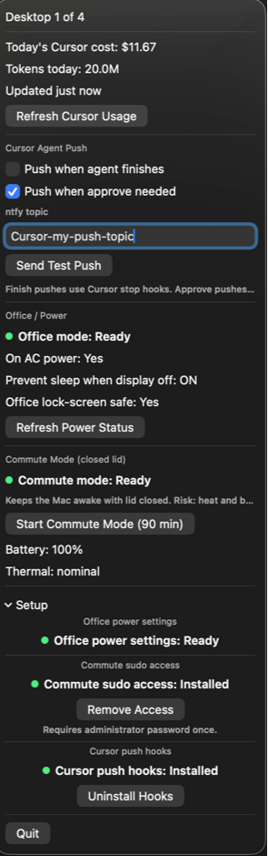

# AI Work Assistant

A macOS menu bar AI work assistant that shows the active desktop number (e.g. `3` or `3/5`) and today's Cursor usage cost (e.g. `3/5 · $0.42`), so you don't have to press Ctrl+↑ to check which desktop you're on or open the Cursor dashboard to see today's spend.

It also includes office power safety checks, commute mode for closed-lid local agents, and optional Cursor agent push notifications via [ntfy.sh](https://ntfy.sh).



See [Quick Start](#quick-start) to build and run in one step.

## Requirements

- macOS 13 (Ventura) or later
- Xcode 15+

## Quick Start

From the repo root:

```bash
git clone https://github.com/dmat751/AIWorkAssistant.git
cd AIWorkAssistant
./scripts/build-and-open-ai-work-assistant.sh
```

The script builds a Release build with `xcodebuild -derivedDataPath build` and opens:

```
build/Build/Products/Release/AIWorkAssistant.app
```

The menu bar icon appears immediately. The app runs as an agent (`LSUIElement`) — it has no Dock icon.

## Modes and what they actually do

Click the menu bar icon to open the menu. The menu bar label itself shows the desktop number, today's Cursor cost when available (for example `3/5 · $0.42`), and a coffee indicator when commute mode is active.

### Desktop indicator (always on)

**What it does:** Shows which Mission Control desktop you are on without pressing Ctrl+↑.

**What it changes:** Nothing. Read-only.

**What you see:** Menu bar label `3` or `3/5`; menu line `Desktop 3 of 5`. Desktop order follows the visual Mission Control layout from `~/Library/Preferences/com.apple.spaces.plist`.

**Limits:** Uses the private CoreGraphics API `CGSCopyManagedDisplaySpaces`, which may change in a future macOS version.

### Cursor cost (always on)

**What it does:** Shows today's Cursor spend and token usage in the menu.

**What it changes:** Nothing. Reads your local Cursor session read-only and calls Cursor's dashboard API.

**What you see:** `Today's Cursor cost`, `Tokens today`, `Updated Xm ago`, and **Refresh Cursor Usage**. The menu bar label also shows the dollar amount when data is available.

**Limits:** You must be logged into Cursor on the same Mac. The usage API is unofficial and may change; if it fails, the desktop number still works and the menu shows the error.

### Cursor Agent Push (optional)

**What it does:** Sends push notifications via ntfy when a local Cursor agent finishes or needs your approval.

**What it changes:** Installs hook scripts into `~/.cursor/hooks/` and optionally starts log monitoring inside AI Work Assistant.

**What you see:** Two independent toggles, an **ntfy topic** field, and **Send Test Push**.

| Toggle | How it works | AI Work Assistant must be running? |
| --- | --- | --- |
| **Push when agent finishes** | Cursor `stop` hook (`./hooks/on-stop.sh`) runs when the agent loop ends | No — Cursor runs the hook |
| **Push when approve needed** | AI Work Assistant tails Cursor structured logs for approval events | Yes |

Finish pushes map agent status to titles like `Cursor: done`, `Cursor: aborted`, or `Cursor: error`. Approve pushes come only from the log monitor — AI Work Assistant does **not** install `beforeShellExecution` or `beforeMCPExecution` hooks, so Cursor's native shell and MCP approval prompts stay in control.

See [Cursor agent notifications](#cursor-agent-notifications-optional) for topic setup and env keys.

### Office mode (desk, plugged in, screen locked)

**What it does:** Checks that your Mac is safe to lock at your desk while plugged in — macOS will not sleep on AC power when the display is off.

**What it changes:** Nothing by itself. It reads `pmset -g custom` and checks the AC profile. **Enable Office Mode** runs `sudo /usr/bin/pmset -c sleep 0` once (admin password prompt), then re-verifies.

**What you see:**

| Line | Meaning |
| --- | --- |
| **Office mode: Ready / Needs attention** | Overall status |
| **On AC power** | Mac is plugged in |
| **Prevent sleep when display off** | AC profile has `sleep 0` in `pmset` |
| **Office lock-screen safe** | Both conditions above are true |

**Limits:** Does not keep the Mac awake with the lid closed. That is what commute mode is for.

You can also enable the setting manually: **System Settings** → **Battery** → **Options** → **Prevent automatic sleeping on power adapter when the display is off**, or `sudo pmset -c sleep 0`. To revert: `sudo pmset -c sleep 10`.

### Commute mode (lid closed, local agent running)

**What it does:** Keeps the Mac awake with the lid closed so a local Cursor agent can keep running during a commute or similar closed-lid session.

**What it changes:** Runs `sudo pmset -a disablesleep 1`, starts a 90-minute lease, and launches a `CommuteFailsafe` helper process. On stop, runs `sudo pmset -a disablesleep 0`.

**What you see:** Status `Active` / `Ready` / `Setup required`, **Start Commute Mode (90 min)** or **Stop Commute Mode**, time remaining, battery percent, and thermal state.

**Limits:**

- Requires [commute sudo access](#passwordless-sudo-for-two-commands) installed first.
- Refuses to start if another tool already disabled sleep.
- Auto-stops after 90 minutes, when battery drops to ≤ 20% on battery power, on `serious` / `critical` thermal pressure, on app quit, or if the fail-safe helper is lost.
- Does **not** use `caffeinate` — that tool does not prevent sleep when the lid is closed.

See [Commute mode safety](#commute-mode-safety) for the full cutoff list and risks.

### Office vs commute

| Scenario | What to use |
| --- | --- |
| Office, plugged in, Ctrl+Cmd+Q lock screen | macOS Battery setting **Prevent automatic sleeping on power adapter when the display is off** — check status in the menu |
| Commute, lid closed, local Cursor agent | **Commute mode** in the menu (90-minute limit) |
| Safest closed-lid workflow | Cursor **Cloud Agent** — laptop can sleep |

## Permissions and why they are needed

Each permission below maps to a specific feature. If you skip it, only that feature breaks — the desktop number always works.

### Admin password, one time, for office mode

**Resource:** Runs `NSAppleScript ... with administrator privileges` to execute `/usr/bin/pmset -c sleep 0`.

**Needed for:** **Enable Office Mode** in the menu or Setup tab.

**Why:** macOS requires admin rights to change the AC power sleep profile. Nothing is stored by AI Work Assistant; cancelling the prompt leaves the status orange.

### Passwordless sudo for two commands

**Resource:** `/etc/sudoers.d/aiworkassistant-commute`, installed `0440 root:wheel`, validated with `visudo -cf`. Allows only:

- `/usr/bin/pmset -a disablesleep 1`
- `/usr/bin/pmset -a disablesleep 0`

**Needed for:** Starting and stopping commute mode, and for all automatic cutoffs (timer, battery, thermal), app quit, and the crash fail-safe to re-enable sleep.

**Why passwordless:** When the lid is closed, nobody is at the keyboard. A password prompt during an auto-cutoff would leave the Mac awake in a bag. The sudoers entry is narrowly scoped to exactly those two commands — nothing else.

Install from **Setup** → **Grant Access**, or:

```bash
sudo ./scripts/install-commute-permission.sh
```

Uninstall:

```bash
sudo ./scripts/uninstall-commute-permission.sh
```

### Read access to the Cursor session database

**Resource:** `~/Library/Application Support/Cursor/User/globalStorage/state.vscdb`, opened `SQLITE_OPEN_READONLY` for key `cursorAuth/accessToken`.

**Needed for:** Today's Cursor cost and token count.

**Without it:** Usage shows `--` or an error; desktop number is unaffected.

### Read access to Cursor logs

**Resource:** `~/Library/Application Support/Cursor/logs` — files matching `*Structured Logs*` and `workbench.mcp.allowlist.log`, tailed by file offset.

**Needed for:** **Push when approve needed** notifications.

**Without it:** Finish pushes still work (Cursor hook); approve pushes do not.

### Write access to `~/.cursor`

**Resource:** Hook scripts copied to `~/.cursor/hooks/`, `notify.env` created with mode `0600`, `hooks.json` merged with a timestamped `.bak` backup.

**Needed for:** **Push when agent finishes** (Cursor `stop` hook).

**Without it:** Approve monitoring can still work; finish pushes do not.

### Network

**Resource:**

- `https://cursor.com/api` — today's usage (unofficial API)
- `https://ntfy.sh/<topic>` — push notifications

**Needed for:** Cursor cost display and ntfy pushes.

**Note:** ntfy topics are unauthenticated — anyone who knows your topic name can read messages. Pick something unguessable.

### Private CoreGraphics API

**Resource:** `CGSCopyManagedDisplaySpaces` for desktop detection.

**Needed for:** Desktop indicator in the menu bar.

**Note:** May break in a future macOS version.

### Not required

AI Work Assistant does **not** need:

- Accessibility permission
- Screen Recording permission
- Full Disk Access
- macOS Notification Center permission (pushes go through ntfy, not Notification Center)

The app is `LSUIElement` — no Dock icon, menu bar only.

## Setup tab

The **Setup** disclosure group at the bottom of the menu is a one-place checklist for everything that needs a one-time install or admin action. Each row shows a colored status dot and one action button.

Statuses re-check automatically every 15 seconds. **Refresh Power Status** in the Office / Power section forces an immediate power check. Every button has an equivalent script in `scripts/` for terminal use.

### Office power settings

Checks whether the AC sleep profile is configured for lock-screen safety.

| Status | Meaning | Action |
| --- | --- | --- |
| **Ready** (green) | Plugged in and `sleep 0` on AC | None needed |
| **Plug in power** (orange) | Not on AC — setting cannot be verified yet | Plug in the adapter |
| **Needs setup** (orange) | On AC but `sleep` is not `0` | **Enable Office Mode** |
| **Unavailable** (grey) | `pmset` could not be read | Check system logs |

**Enable Office Mode** runs `sudo pmset -c sleep 0` and asks for your admin password once.

### Commute sudo access

Checks whether passwordless `pmset disablesleep` access is installed.

| Status | Meaning | Action |
| --- | --- | --- |
| **Installed** (green) | `/etc/sudoers.d/aiworkassistant-commute` is present | **Remove Access** |
| **Not installed** (orange) | Commute mode cannot start | **Grant Access** |

Both buttons prompt for your admin password once. **Remove Access** is disabled while commute mode is active — stop commute mode first.

Terminal equivalents:

```bash
sudo ./scripts/install-commute-permission.sh
sudo ./scripts/uninstall-commute-permission.sh
```

### Cursor push hooks

Checks whether the Cursor `stop` hook and supporting scripts are installed in `~/.cursor/`.

| Status | Meaning | Action |
| --- | --- | --- |
| **Installed** (green) | `on-stop.sh`, `notify-ntfy.sh`, and `hooks.json` entry present | **Uninstall Hooks** |
| **Not installed** (orange) | Finish pushes will not fire | **Install Hooks** |

**Install Hooks** copies scripts to `~/.cursor/hooks/`, merges the `stop` hook into `hooks.json` (backing up any existing file), creates `notify.env` from the example, and sends a test push when a topic is already configured.

On app launch, hook scripts are auto-migrated if a newer version ships updated files. If the menu shows *"Push hooks were updated automatically. Restart Cursor once."*, restart Cursor and verify in **Customize → Hooks**.

Terminal equivalents:

```bash
./scripts/install-cursor-notify-hooks.sh
./scripts/uninstall-cursor-notify-hooks.sh
```

## Cursor agent notifications (optional)

Send push notifications via [ntfy.sh](https://ntfy.sh) when a local Cursor agent finishes or needs your approval.

Install from the menu toggles, **Setup** → **Install Hooks**, or:

```bash
./scripts/install-cursor-notify-hooks.sh
```

Set your ntfy topic in the menu **ntfy topic** field or in `~/.cursor/hooks/notify.env`:

```bash
NTFY_TOPIC=your-topic-name
NTFY_ENABLED=1
NTFY_APPROVE_ENABLED=1
```

Send a test push from **Send Test Push** in the menu.

Enable or disable from the toggles:

- **Push when agent finishes** — installs or removes the Cursor `stop` hook; writes `NTFY_ENABLED=1` or `0`
- **Push when approve needed** — starts or stops log monitoring; writes `NTFY_APPROVE_ENABLED=1` or `0`

No Cursor restart is required for toggle changes. After installing or updating hooks, restart Cursor once and verify in **Customize → Hooks**. If finish notifications do not arrive, open the **Hooks** output channel for errors.

**Approve coverage:** Approve pushes come from the log monitor (`Shell permissions: requesting shell approval`, sandbox shell runs with `allCommandsPreapproved` + not allowlisted, and `shouldBlockMcp: needsApproval`). Shell approvals wait briefly for Cursor's approval gate outcome, so auto-rejected or auto-allowed commands do not trigger a push.

## Commute mode safety

When commute mode is enabled, the app and an embedded `CommuteFailsafe` helper monitor:

- **90-minute timer** — auto-disable after 90 minutes
- **Battery ≤ 20% on battery power** — auto-disable so the Mac can sleep
- **Thermal pressure (`serious` / `critical`)** — auto-disable so the Mac can sleep and cool down; finish the task at home
- **App quit** — disables commute mode on normal quit
- **Fail-safe helper** — if the menu app crashes, the helper still disables sleep when limits are hit

**Risks:** heat buildup in a bag, faster battery drain, and interrupted agent tasks after automatic shutdown. Do not leave commute mode running indefinitely.

## Launch at login (optional)

1. Open **System Settings** → **General** → **Login Items & Extensions** → **Open at Login**.
2. Click **+** and select `AIWorkAssistant.app`.

Alternatively, you can copy the app to `/Applications` and add it from there.

## Scripts

All scripts live in `scripts/` and should be run from the repo root:

| Script | Purpose | In app menu |
| --- | --- | --- |
| `./scripts/build-and-open-ai-work-assistant.sh` | Build Release and open the app | — |
| `./scripts/install-commute-permission.sh` | Install commute-mode sudoers entry (run with `sudo`) | **Setup** → **Grant Access** |
| `./scripts/uninstall-commute-permission.sh` | Remove commute-mode sudoers entry (run with `sudo`) | **Setup** → **Remove Access** |
| `./scripts/install-cursor-notify-hooks.sh` | Install Cursor notify hooks into `~/.cursor/` | **Setup** → **Install Hooks** |
| `./scripts/uninstall-cursor-notify-hooks.sh` | Remove AI Work Assistant Cursor notify hooks | **Setup** → **Uninstall Hooks** |

## Manual build

If you prefer not to use the build script, from the repo root:

```bash
xcodebuild -scheme AIWorkAssistant -configuration Release -derivedDataPath build build
open build/Build/Products/Release/AIWorkAssistant.app
```

When building from Xcode (without `-derivedDataPath build`), check the path in the `xcodebuild` log.

## Testing

```bash
xcodebuild -scheme AIWorkAssistant -configuration Debug -derivedDataPath build test
```

Unit tests use mocks and do not change system power settings.

## Notes

- Desktop order follows the visual Mission Control layout from `~/Library/Preferences/com.apple.spaces.plist`.
- Cursor usage is read from the local session database and fetched from Cursor's dashboard API. You must be logged into Cursor on the same Mac.
- The Cursor usage API is unofficial and may change without notice. If usage cannot be loaded, the desktop number still works and the menu shows the error.
